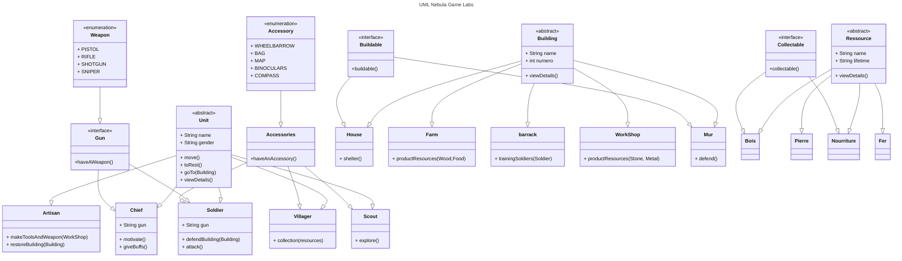
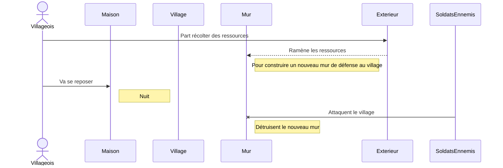

#  Brief 8 #
### 1 - Forker le projet pour l'ouvrir dans un editeur de code ###
### 2 - Se référer au Diagramme de classes du brief 9 ci-dessous ###
### 3 - Dans la class Main cliquer sur "run" pour afficher le scénario des logs dans le terminal ###

#  Brief 9 #
# Diagramme de classes #

# Diagramme de séquence #
### Scenario brief 9 ###

